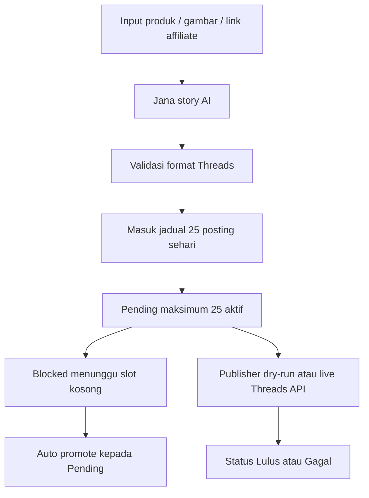

# ThreadsMe

**ThreadsMe** ialah sistem automasi kandungan Threads untuk affiliate marketing. Sistem ini membantu jana story produk dalam Bahasa Melayu Malaysia, susun jadual 25 posting sehari, pantau status queue, dan sediakan publisher automatik melalui Threads API.

Nama rasmi sistem:

| Item | Maklumat |
| --- | --- |
| Nama sistem | ThreadsMe |
| Repo slug | threadsme |
| Versi | v0.9.7 |
| Bahasa UI | Bahasa Melayu Malaysia |
| Zon masa | Asia/Kuala_Lumpur |
| Kredit | Sistem Dibangunkan Sepenuhnya Oleh Akmal Marvis |
| Localhost rasmi | `http://localhost/threadsme/` |

## Fail Ingatan dan Operasi

Fail berikut menjadi rujukan utama bila kerja ThreadsMe disambung semula:

| Fail | Tujuan |
| --- | --- |
| `SYSTEM_MEMORY.md` | Ingatan sistem: tetapan rasmi, peraturan story, status queue, prinsip design, dan larangan penting. |
| `docs/OPERATION_RUNBOOK.md` | Cara menjalankan, menyemak, deploy, dan memulihkan ThreadsMe. |
| `docs/IMPROVEMENT_BACKLOG.md` | Senarai cadangan tambah baik yang sudah dikenal pasti dan boleh dibuat selepas ini. |

## Fungsi Utama

- Jana siri 3 post Threads: `[POST UTAMA]`, `[REPLY 1]`, `[REPLY 2]`.
- Storytelling deep storyline untuk netizen Malaysia.
- Input produk melalui tajuk produk wajib, kategori/kegunaan produk, gambar upload, paste gambar, link gambar, nota produk, dan link affiliate.
- Pilihan posting sehari termasuk `25 posting / hari`.
- Auto cipta story dan terus masukkan ke jadual ThreadsMe.
- Kalendar jadual harian dengan semakan 25 slot sehari.
- Status posting: `Lulus`, `Pending`, `Blocked`, `Gagal`, `Disediakan`, dan `Perlu Semak`.
- Auto promote `Blocked` kepada `Pending` bila slot schedule kosong.
- Auto Audit Produk berjalan bersama sync automation untuk sahkan produk secara autopilot, auto-regenerate story yang tidak selari, dan guard output berisiko.
- Pusat `Tindakan Saya` memaparkan ringkasan autopilot; input Akmal hanya optional melalui butang edit/override.
- Product Audit untuk baiki siri lama yang tiada tajuk produk atau story tidak relevan.
- Product Audit memaparkan ayat semasa `[POST UTAMA]`, `[REPLY 1]`, dan `[REPLY 2]` untuk semakan sebelum regenerate.
- Quality Gate sebelum story masuk jadual: relevansi produk, hook, BM Malaysia, claim, CTA, dan had 300 aksara.
- Product Intelligence untuk cuba ekstrak tajuk/kategori daripada link Shopee, affiliate, gambar, nota, dan DeepSeek.
- Auto Audit boleh auto isi dan auto sahkan metadata produk daripada link affiliate Shopee, gambar, nota, dan DeepSeek jika confidence cukup.
- Product Intel cache runtime supaya link affiliate yang sama tidak perlu disemak berulang selepas restart.
- Automation Health untuk semak AI server, DeepSeek key, Pending 25/25, Blocked, publisher, dan audit issue.
- Preview Netizen untuk semak rasa manusia sebelum publish.
- Publisher Threads API dengan mode `Dry-run` dan mode live apabila token rasmi sudah diset.
- Mode single-user local tanpa login secara default, dengan admin auth optional jika mahu public deploy.
- CORS terkawal, CSRF token untuk POST, dan runtime backup satu klik.
- UI refresh gaya Kumo UI dan `gpt-taste`: semantic color token, surface hierarchy, sidebar premium, table compact, focus state jelas, dan motion GSAP yang ringan.

## Workflow Produk Tepat

Untuk elak story lari daripada produk sebenar, ThreadsMe akan cuba auto kenal produk daripada link affiliate Shopee terlebih dahulu. Sistem akan resolve redirect Shopee, simpan `shopid/itemid`, cuba metadata/API Shopee, kemudian gunakan DeepSeek untuk cadangan kategori dan semakan alignment.

Jika bukti link cukup, metadata ditanda `link_verified` dan boleh terus masuk flow jadual. Jika Shopee block detail tetapi DeepSeek/Product Intel masih boleh infer dengan confidence cukup, metadata `story_inferred` juga boleh disahkan autopilot dan terus melalui Quality Gate. Hanya confidence rendah atau tajuk kosong akan diguard supaya tidak masuk publish.

Untuk semakan Shopee yang lebih lengkap, ThreadsMe menyokong cookie login secara private melalui env `SHOPEE_COOKIE` atau fail `work/private/shopee-cookie.txt`. Fail ini tidak di-commit. Jika cookie tiada atau expired, sistem akan fallback kepada metadata redirect + DeepSeek dan label confidence akan diturunkan.

Cadangan input minimum untuk hasil paling tepat:

- `Link affiliate produk`: link CTA wajib yang akan diletakkan di akhir Reply 2.
- `Tajuk produk`: auto diisi oleh ThreadsMe; boleh diedit manual hanya jika Akmal mahu override.
- `Kategori / kegunaan produk`: fungsi ringkas produk, contoh `sambal ready-to-eat, lauk cepat, penambah selera`.
- `Nota gambar / produk`: konteks emosi atau situasi, contoh `sesuai untuk nasi panas, telur, ayam goreng, hari malas masak`.

ThreadsMe hanya akan guard generate jika produk masih tidak dapat dikenal pasti dengan yakin selepas auto product-intel. Jika produk sudah sah tetapi story tidak cukup relevan, Auto Audit akan cuba auto-regenerate sehingga 25 siri satu batch. Prompt DeepSeek juga dikunci supaya AI tidak tukar kategori produk atau reka manfaat yang tidak berkaitan.

## Cara Jalankan

Keperluan:

- Node.js 18 atau lebih baru.
- Akaun DeepSeek jika mahu jana story AI.
- Threads API user ID dan access token jika mahu publish live.

Pasang dan jalan:

```bash
npm install
npm run start
```

URL rasmi localhost pada PC ini menggunakan Apache/XAMPP:

```text
http://localhost/threadsme/
```

Untuk deploy semula fail static ke XAMPP:

```bash
npm run deploy:xampp
```

Jika mahu jalan terus dengan Node tanpa XAMPP, guna fallback dev:

```bash
npm run start:dev
```

```text
http://localhost:8791/threadsme/
```

Jalankan server AI dalam terminal lain:

```bash
npm run ai
```

Atau hidupkan server AI secara background:

```bash
npm run ai:hidden
```

Server AI default:

```text
http://127.0.0.1:8788
```

## Keselamatan Admin

ThreadsMe default kepada mode single-user local kerana sistem ini digunakan oleh Akmal seorang di PC sendiri.

Default local:

- `THREADSME_AUTH_REQUIRED=false`.
- Dashboard dan API automation boleh jalan terus tanpa sesi admin.
- DeepSeek key status dipaparkan terus di health/GUI.

Jika mahu deploy public:

- Set `THREADSME_AUTH_REQUIRED=true`.
- Password admin boleh diset melalui GUI pada login pertama atau env `THREADSME_ADMIN_PASSWORD`.
- Session cookie ialah `HttpOnly` + `SameSite=Lax`.
- Semua `POST` protected perlukan CSRF token daripada login session.
- CORS hanya benarkan origin dalam `THREADSME_ALLOWED_ORIGINS`.

Contoh origin local:

```text
http://localhost,http://localhost:80,http://127.0.0.1,http://127.0.0.1:80,http://localhost:8791,http://127.0.0.1:8791
```

Jika deploy ke domain sebenar, tambah domain itu dalam `THREADSME_ALLOWED_ORIGINS` dan jangan guna wildcard.

## Product Intel Cache

ThreadsMe menyimpan metadata produk yang cukup yakin di:

```text
work/runtime/product-intel-cache.json
```

Default cache:

- TTL: `14` hari melalui `THREADSME_PRODUCT_INTEL_CACHE_DAYS`.
- Maksimum entry: `250` melalui `THREADSME_PRODUCT_INTEL_CACHE_MAX`.
- Cache hanya menyimpan metadata produk, bukan cookie/token.

## API Key

ThreadsMe tidak commit API key ke repo.

Pilihan DeepSeek:

```bash
set DEEPSEEK_API_KEY=sk-...
npm run ai
```

Atau simpan dalam fail private:

```text
work/private/deepseek.key
```

Shopee cookie untuk Product Intel:

```text
work/private/shopee-cookie.txt
```

Threads access token pula boleh disimpan melalui GUI Publisher atau melalui env:

```bash
set THREADS_ACCESS_TOKEN=...
```

Fail private yang diabaikan git:

```text
work/private/
work/runtime/
work/backups/
work/qa-runtime-*/
publish-log.json
.env
```

## Semakan QA

Semak syntax dan smoke test API:

```bash
npm run check
npm run qa:smoke
```

Smoke test akan hidupkan AI server temp, uji auth setup, CSRF, CORS reject, generate story fallback, simpan cookie Shopee kosong, dan buat runtime backup.

## Struktur Sistem

```text
threadsme/
|-- assets/
|   |-- flexi-marble-sheet.png
|   |-- flexi-marble-sheet.webp
|   |-- vendor/
|   |   |-- ScrollTrigger.min.js
|   |   `-- gsap.min.js
|   |-- threadsme-favicon.svg
|   `-- threadsme-logo.svg
|-- docs/
|   |-- IMPROVEMENT_BACKLOG.md
|   `-- OPERATION_RUNBOOK.md
|-- scripts/
|   |-- deploy-xampp.ps1
|   |-- qa-smoke.mjs
|   `-- start-ai-hidden.ps1
|-- ai-server.mjs
|-- app.js
|-- index.html
|-- server.mjs
|-- SYSTEM_MEMORY.md
|-- status.json
|-- story-runs.json
|-- styles.css
|-- threads_flexi_marble_schedule.json
|-- package.json
|-- .env.example
|-- .gitignore
`-- README.md
```

## Database JSON

ThreadsMe menggunakan JSON file database supaya ringan dan mudah audit.

| Fail | Fungsi |
| --- | --- |
| `threads_flexi_marble_schedule.json` | Snapshot jadual contoh/legacy untuk fallback static. Runtime sebenar kini disalin ke `work/runtime/threads-schedule.json`. |
| `work/runtime/threads-schedule.json` | Jadual aktif untuk siri posting, slot, CTA, affiliate link, dan metadata produk. Fail ini tidak di-commit. |
| `status.json` | Snapshot status queue contoh/legacy untuk fallback static. Runtime sebenar kini disalin ke `work/runtime/status.json`. |
| `story-runs.json` | Snapshot rekod output AI contoh/legacy untuk fallback static. Runtime sebenar kini disalin ke `work/runtime/story-runs.json`. |
| `work/runtime/*.json` | Runtime database aktif untuk status, story runs, dan publish log. Fail ini tidak di-commit. |
| `work/runtime/product-intel-cache.json` | Cache metadata Product Intel untuk link Shopee/affiliate yang sudah dikenal pasti. Fail ini tidak di-commit. |
| `work/backups/*.json` | Snapshot backup runtime daripada GUI/API. Fail ini tidak di-commit. |
| `publish-log.json` | Log publisher legacy. Runtime aktif ialah `work/runtime/publish-log.json`. Fail ini tidak di-commit. |
| `work/private/*.json` dan `work/private/*.txt` | Token/API key private. Fail ini tidak di-commit. |

## Workflow Automation



## Prinsip Reka Bentuk

ThreadsMe kini mengambil inspirasi daripada Kumo UI tanpa menukar stack vanilla:

- Semantic token untuk warna, teks, border, status dan surface.
- Surface hierarchy yang jelas untuk sidebar, dashboard, calendar, queue, preview dan publisher.
- Komponen gaya resource-list dan compact table untuk status posting.
- Focus state dan hover state yang lebih jelas untuk penggunaan harian.
- Motion GSAP ringan untuk reveal dan hover, bukan animasi berat.

## Nota Had Threads

ThreadsMe mengekalkan queue aktif maksimum 25 siri Pending untuk mengelakkan jadual bertindih. Baki siri akan kekal `Blocked` sehingga slot kosong. Status hanya patut dianggap `Pending` selepas ThreadsMe berjaya memasukkan siri ke queue automation.

## Version Log

### v0.9.7

- Tambah Product Intel runtime cache di `work/runtime/product-intel-cache.json`.
- Cache metadata produk yang cukup yakin supaya link affiliate sama tidak ulang semakan Shopee/DeepSeek selepas restart.
- Automation Health kini papar jumlah cache produk dalam kad `Shopee Intel`.
- Runtime backup kini sertakan Product Intel cache.
- Smoke test kini menguji Product Intel cache hit dan backup cache.
- Default auth ditukar kepada single-user local mode (`THREADSME_AUTH_REQUIRED=false`) supaya sistem Akmal jalan terus tanpa login.

### v0.9.6

- Tambah admin auth, first-run setup, session cookie, dan CSRF token untuk POST API.
- Lock CORS kepada origin localhost yang dibenarkan melalui `THREADSME_ALLOWED_ORIGINS`; wildcard dibuang.
- Betulkan static server path guard menggunakan `path.relative` untuk kurangkan risiko traversal/prefix edge case.
- Validation error API kini pulang HTTP `400/401/403/404` yang sesuai dan mesej server crash disanitasi sebagai `500`.
- Tambah panel `Shopee Product Intel` untuk simpan/clear cookie Shopee private melalui GUI.
- Tambah runtime backup/export melalui API dan butang `Backup runtime`.
- Host GSAP dan ScrollTrigger secara local di `assets/vendor/` supaya GUI tidak bergantung kepada CDN.
- Tukar preview image produk kepada WebP ringan.
- Tambah `npm run qa:smoke` untuk semakan auth, CORS, CSRF, generate story fallback, Shopee cookie config, dan backup.
- Kemas mobile navigation supaya kandungan utama tidak jatuh terlalu jauh di skrin kecil.

### v0.9.5

- Tambah auto product resolver untuk link affiliate Shopee: resolve redirect, simpan `shopid/itemid`, cuba metadata/API Shopee, dan gunakan DeepSeek untuk product intel berconfidence.
- Auto Audit kini boleh mengisi `productTitle`, `productCategory`, `productIntelConfidence`, `productIntelEvidence`, dan `productVerified` secara automatik.
- Siri `story_inferred` kini boleh lulus autopilot jika confidence DeepSeek/Product Intel cukup; hanya confidence rendah atau tajuk kosong diguard.
- Jana Story kini cuba `Auto semak produk Shopee` sendiri apabila tajuk produk kosong, kemudian Akmal masih boleh edit metadata sebagai override pilihan.

### v0.9.4

- Tambah `Auto Audit Produk` yang berjalan bersama sync automation dan boleh dipaksa melalui UI.
- Tambah halaman/menu `Tindakan Saya` untuk mengurangkan penglibatan manual dan fokus pada isu produk yang paling penting.
- Redesign UI ke arah minimal premium: warna lebih warm, surface lebih flat, action ledger lebih jelas, dan responsive action cards.

### v0.9.3

- Tukar logo utama dan favicon kepada identiti ThreadsMe baharu berasaskan monogram `T`.
- Bump cache favicon/CSS supaya `http://localhost/threadsme/` memaparkan aset logo terbaru.

### v0.9.2

- Tambah preview ayat semasa dalam `Audit Produk` supaya siri lama boleh disemak sebelum metadata disimpan atau story regenerated.
- API Product Audit kini memulangkan `main`, `reply1`, dan `reply2` penuh untuk semakan copywriting dalam GUI.
- Kekalkan render preview audit menggunakan DOM selamat dan `textContent` supaya teks AI/user tidak memecahkan layout.

### v0.9.1

- Pindahkan schedule aktif ke `work/runtime/threads-schedule.json` supaya generate story tidak mengubah fail tracked repo.
- Kalendar kini mengira `Perlu Semak` sebagai isu harian.
- Product Audit tidak lagi double-count review item yang sama antara schedule dan story-runs.

### v0.9.0

- Tukar nama sistem rasmi kepada ThreadsMe di UI, docs, env, aset, dan route localhost.
- Tukar URL rasmi kepada `http://localhost/threadsme/`.
- Tambah modul `Audit Produk` untuk batch metadata dan regenerate story.
- Tambah `Quality Gate` sebelum story masuk jadual supaya output yang tidak relevan ditahan sebagai `Perlu Semak`.
- Tambah `Product Intelligence` untuk cuba kenal pasti tajuk/kategori produk daripada link Shopee/affiliate/gambar/nota.
- Tambah panel `Automation Health` dan `Preview Netizen`.
- Pindahkan runtime JSON aktif termasuk schedule ke `work/runtime/` supaya repo tidak kerap dirty kerana automation.
- Tukar render dinamik frontend kepada DOM builder + `textContent` untuk elak layout rosak oleh teks AI/user.

### v0.8.0

- Tambah field wajib `Tajuk produk` dan `Kategori / kegunaan produk` di Jana Story supaya AI tidak meneka produk daripada URL gambar.
- Prompt DeepSeek kini mengunci storytelling kepada produk sebenar dan melarang tukar kategori produk.
- Story run kini simpan `productTitle` dan `productCategory` untuk audit semula.

### v0.7.9

- Betulkan metrik dashboard supaya `Pending` ikut queue rasmi `scheduled` dan kekal 25/25 apabila automasi penuh.
- Nota status table kini papar `Pending aktif 25/25` berdasarkan queue automation, bukan kiraan paparan slot.

### v0.7.8

- Fix fungsi Jana Story apabila AI server offline atau DeepSeek key tiada.
- Tambah fallback story generator tempatan supaya output masih dijana dan terus masuk Jadual Threads.
- Tambah endpoint `/api/system-data` supaya GUI XAMPP baca jadual/status dinamik dari AI server.
- Tambah script `npm run ai:hidden` untuk hidupkan ThreadsMe AI server di background.
- Update mesej error frontend supaya tidak hanya papar `Failed to fetch`.

### v0.7.7

- Guna prinsip Kumo UI pada ThreadsMe tanpa menukar stack vanilla: semantic tokens, surface hierarchy, table/resource-list pattern, focus states, dan badges status yang lebih jelas.
- Ganti CSS lama yang bertindih dengan design system lebih kecil, konsisten, dan mudah dibaca.
- Kemas cache CSS kepada `styles.css?v=10` dan tambah `data-mode="light"` serta `data-theme="kumo"` pada HTML.

### v0.7.6

- Tukar default ThreadsMe kepada `25 posting / hari`.
- Tambah option `25 posting / hari` di Jana Story dan `25 siri` di automasi publisher.
- Kalendar Jadual Threads kini menyemak sasaran 25 slot sehari.

### v0.7.5

- Guna `redesign-skill` untuk audit dan polish targeted pada sistem ThreadsMe.
- Tambah skip-link, meta description, OG metadata, state kosong yang lebih kemas, dan busy state untuk butang AI.
- Buang pautan palsu apabila affiliate link tiada dan kemaskan surface visual supaya dashboard lebih profesional.

### v0.7.4

- Kunci responsive mobile supaya panel ThreadsMe tidak melebar keluar viewport.
- Topbar dan metrik dipaksa kepada satu kolum pada skrin kecil untuk bacaan lebih selesa.

### v0.7.3

- Tambah option `20 posting / hari` dan jadual kalendar harian.
- Auto schedule story yang dijana supaya fungsi Jana Story, Jadual Threads, dan status berkait.

### v0.7.2

- Tambah status story dijana.
- Sambungkan output AI kepada jadual tempatan ThreadsMe.

### v0.7.1

- Kemaskan GUI dengan side menu dan modul berasingan.

### v0.7.0

- Release awal ThreadsMe.
